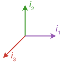

# MulticomplexNumbers.jl

[](https://waudbylab.github.io/MulticomplexNumbers.jl/stable)
[](https://waudbylab.github.io/MulticomplexNumbers.jl/dev)
[](https://github.com/waudbylab/MulticomplexNumbers.jl/actions/workflows/Runtests.yml)
[](https://codecov.io/gh/waudbylab/MulticomplexNumbers.jl)



A Julia package for representing multicomplex numbers and performing multicomplex algebra.

## Installation

```julia
using Pkg
Pkg.add("MulticomplexNumbers")
```

## Quick Start

```julia
using MulticomplexNumbers

# Create multicomplex numbers
z = 1.0 + 2.0*im1                    # Complex (order 1)
w = 1.0 + 2.0*im1 + 3.0*im2          # Bicomplex (order 2)

# Arithmetic works naturally
z * w
exp(w)
sqrt(w)

# Numerical differentiation example
# Compute f'(x) for f(x) = x^3 at x = 2
h = 1e-100
x = 2.0 + h*im1
f_x = x^3
derivative = imag(f_x) / h  # Returns 12.0 (exact!)
```

## What are Multicomplex Numbers?

Multicomplex numbers are a generalisation of complex numbers, recursively defined to contain multiple imaginary numbers, $i_1$, $i_2$ etc. Unlike Clifford algebras, these numbers commute, i.e. $i_1i_2=i_2i_1$.

The primary application is a natural, exact representation of **multi-dimensional NMR spectroscopy** data: each quadrature dimension of an _n_-dimensional experiment maps to one imaginary unit of an order-_n_ multicomplex number, so the per-dimension Fourier transforms and phase corrections become ordinary multicomplex arithmetic ([Delsuc, 1988](https://doi.org/10.1016/0022-2364(88)90036-4)). The same construction applies to multi-dimensional **MRI**, where a 2D or 3D image is a bi- or tricomplex array. Multicomplex numbers also enable **high-precision numerical differentiation**: the multicomplex step method computes derivatives — including high-order and mixed partials — with machine precision, avoiding the subtractive cancellation errors of finite differences.

## Features

- **Full arithmetic**: `+`, `-`, `*`, `/`, `^`, `exp`, `log`, `sqrt`
- **Imaginary units**: `im1` through `im6` (orders 1-6)
- **Type-stable**: Uses StaticArrays for performance
- **FFT support**: Via FFTW extension (load FFTW to enable)

## References

* Delsuc MA. Spectral representation of 2D NMR spectra by hypercomplex numbers. J Magn Reson. 1988;77: 119–124. https://doi.org/10.1016/0022-2364(88)90036-4
* NIST report on multicomplex algebra: https://nvlpubs.nist.gov/nistpubs/jres/126/jres.126.033.pdf
* NIST C++ implementation: https://github.com/usnistgov/multicomplex
* Casado JMV, Hewson R. Algorithm 1008: Multicomplex Number Class for Matlab. ACM Trans Math Softw. 2020;46: 1–26. http://dx.doi.org/10.1145/3378542
